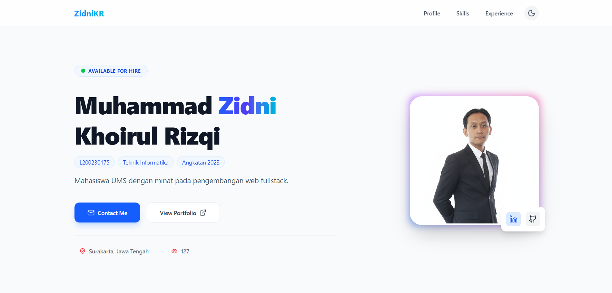
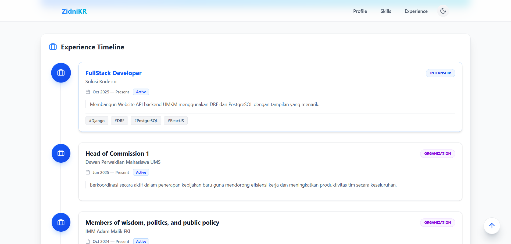
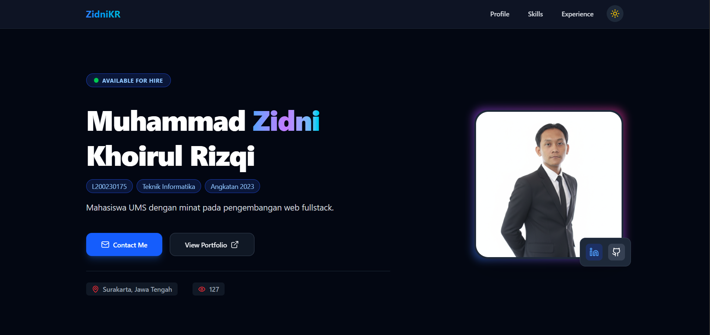
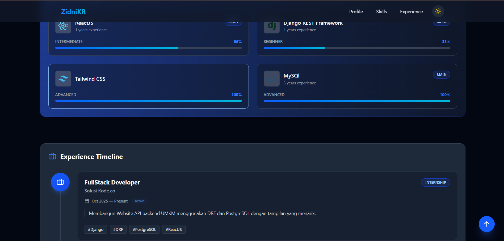

# 🌐 Personal Portfolio — ZidniKR

Aplikasi ini adalah **Personal Web Portfolio** yang dibangun menggunakan **ReactJS** dan **Tailwind CSS**. Website ini menampilkan profil profesional, keterampilan teknis, dan pengalaman kerja dengan tampilan modern, responsif, dan interaktif.

---

## 🚀 Fitur Utama

### **1. Dual Theme (Dark & Light Mode)**
- Pengguna dapat mengganti tema secara instan.
- Preferensi tema disimpan di `localStorage`.
- Tampilan dark mode menggunakan palet warna deep gray/slate.
- Tampilan light mode menggunakan warna putih dengan aksen biru profesional.

### **2. Responsive Design**
- Tampilan website beradaptasi otomatis pada Mobile, Tablet, dan Desktop.
- Navbar berubah menjadi Hamburger Menu pada mode mobile.
- Konten menggunakan lebar 75% pada layar besar untuk keterbacaan optimal.

### **3. Smooth Navigation**
- Smooth Scrolling ke setiap section (Profile, Skills, Experience).
- Tombol **Back to Top** muncul otomatis saat pengguna scroll ke bawah.

### **4. Dynamic Data Rendering**
- Mengambil data dari file JSON (`dataMahasiswa`) sehingga konten mudah diperbarui tanpa mengubah UI.
- Struktur data rapi untuk profil, skills, dan pengalaman.

### **5. Komponen Interaktif**
- **Experience Timeline**: Menampilkan pengalaman dengan layout garis waktu vertikal.
- **Skill Bars**: Menampilkan tingkat kemahiran dengan animasi.
- **Glassmorphism Navbar**: Efek blur modern yang mengikuti pergerakan scroll.

---

## 🛠️ Teknologi yang Digunakan

| Teknologi            | Fungsi                      |
| -------------------- | --------------------------- |
| **ReactJS**          | Library frontend utama      |
| **Vite**             | Build tool cepat dan modern |
| **Tailwind CSS**     | Utility-first styling       |
| **Lucide React**     | Icon pack modern            |
| **LocalStorage**     | Menyimpan preferensi tema   |

---

## 📦 Cara Menjalankan Aplikasi

Ikuti langkah berikut untuk menjalankan aplikasi di local environment.

### 🔧 **Prasyarat**
Pastikan perangkat sudah terinstall:
- **Node.js** versi 16+
- **npm** (Node Package Manager)

---
## Install React + Vite
Buka terminal di direktori proyek, lalu jalankan:
```bash
npx craete-vite@latest
```
---

## 🔵 1. Instalasi Dependensi

Buka terminal di direktori proyek, lalu jalankan:

```bash
npm install
npm install tailwindcss @tailwindcss/vite
npm install lucide-react
```


---

## 🔵 2. Konfigurasi Tailwind CSS (Jika belum ada)

Pastikan file vite.config.js berisi:
```js
import { defineConfig } from 'vite'
import react from '@vitejs/plugin-react'
import tailwindcss from '@tailwindcss/vite'

export default defineConfig({
  plugins: [
    react(),
    tailwindcss(),
  ],
})
```

---

## 🔵 3. Menjalankan Server Development

Untuk mode pengembangan (dengan hot reload), jalankan:
```bash
npm run dev
```
Aplikasi local hanya bisa dijalankan di
```
http://localhost:5173
```

---

## 🚀 Live Demo

Aplikasi dapat diakses melalui link berikut:

🔗 **[https://tugas-web-framework-portofolio.vercel.app/](https://tugas-web-framework-portofolio.vercel.app/)**

---

## 📁 Struktur Project

```
.
├── public/
│   └── example_screenshot.png
│
├── src/
│   ├── assets/
│   │   └── MyProfile.png
│   │
│   ├── components/
│   │   ├── Experiences.jsx
│   │   ├── Profile.jsx
│   │   └── Skills.jsx
│   │
│   ├── partials/
│   │   ├── ExperienceCard.jsx
│   │   ├── SkillCard.jsx
│   │   ├── Footer.jsx
│   │   ├── Navbar.jsx
│   │   └── ScrollToUp.jsx
│   │
│   ├── App.jsx
│   ├── index.css
│   └── main.jsx
│
├── dataMahasiswa.json
│
├── DOC.md
├── README.md
├── README_ID.md
├── README_EN.md
│
├── index.html
├── vite.config.js
├── package.json
├── package-lock.json
└── .gitignore
```

---

## 📸 Screenshot






## 📸 Dark Mode




---
## ✨ Developer

**Muhammad Zidni Khoirul Rizqi**
Tugas Membuat Single Page Aplication

---